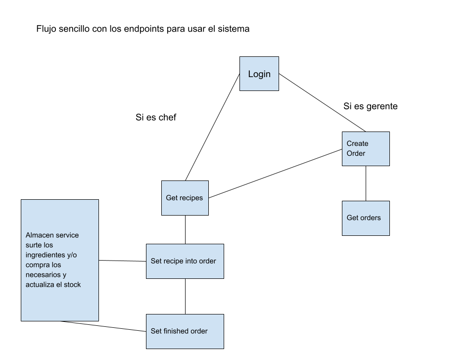

# 📦 Configuración del Proyecto con Git y Docker

Este documento detalla los pasos necesarios para clonar y desplegar el proyecto utilizando **Git** y **Docker Compose**.

## 🚀 Pasos de Instalación

### 1️⃣ Clonar los Repositorios

Ejecuta los siguientes comandos para obtener el código fuente:

```bash
git clone https://github.com/ivandanielcruzs/tu-repositorio.git
cd tu-repositorio/backend
git clone https://github.com/ivandanielcruzs/cocina-service.git
git clone https://github.com/ivandanielcruzs/almacen-service.git
```

### 2️⃣ Configurar Variables de Entorno

Después de clonar los repositorios, completa el archivo `.env` en la carpeta raíz con la configuración necesaria.

Si el frontend no reconoce las variables del `.env` en la raíz, crea un archivo `.env` dentro de la carpeta `kitchen_panel` y vuelve a ejecutar el siguiente comando.

### 3️⃣ Construcción y Despliegue con Docker

Ejecuta los siguientes comandos:

```bash
docker-compose build
```

```bash
docker-compose up -d
```

---

## 📡 API - Endpoints Disponibles

El sistema cuenta con una colección de endpoints para resolver el reto técnico:

- **Autenticación**

  - `Login [chef, gerente]`
  - `Set token [chef, gerente]` *(Funcionalidad en mejora)*
  - `Get Profile [chef, gerente]`

- **Gestión de Órdenes**

  - `Create Order [gerente]`
  - `Get Orders [chef, gerente]`
  - `Get Order by Id [chef, gerente]`
  - `Set Finished Order [chef]`

- **Gestión de Recetas e Ingredientes**

  - `Get Recipes [chef, gerente]`
  - `Set Recipe into Order [chef]`
  - `Get Ingredients [chef, gerente]`
  - `Get Purchase [chef, gerente]`

---

## ⚙️ Arquitectura del Sistema

El sistema se compone de **dos microservicios** diseñados para abordar la problemática de gestión de cocina e inventario:

### **1️⃣ Cocina Service (Monolito Robusto)**

- Maneja la lógica de autenticación con **JWT**.
- Gestiona los endpoints principales del frontend.
- Como mejora, se encarga de enviar notificaciones en segundo plano.

### **2️⃣ Almacén Service (Microservicio Ligero)**

- Escucha eventos en una **cola BullMQ**.
- Verifica la disponibilidad de ingredientes.
- Realiza compras a un endpoint externo cuando los ingredientes son insuficientes.
- Actualiza el stock y notifica cuándo una orden está lista para prepararse.

---

## 👥 Usuarios de Prueba

El sistema actualmente cuenta con los siguientes usuarios predefinidos:

| Usuario | Contraseña    |
| ------- | ------------- |
| gerente | Securepass500 |
| chef\_1 | Securepass456 |

---

## 🗄️ Base de Datos

Para poblar la base de datos en **MongoDB**, se incluye un archivo `seed.ts` que permite generar datos de prueba si es necesario.

---

## 📷 Imagen de referencia



---

Con esta configuración, el sistema estará listo para su ejecución y prueba. 🚀🔥

